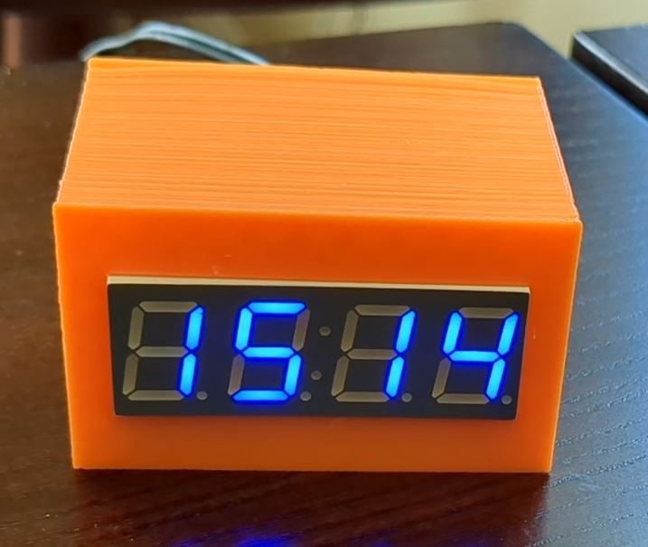

7 Segment internet clock 
========================

This is the firmware for a seven segment internet connected clock using
a Raspberry PI PicoW. 

Probably over-engineered but was used as a learning project for using
this MCU board. It runs a web server which reports the time too but also allows
setting of the time zone for the clock. Uses NTP to keep time correct.

My prototype:

To set up the wifi connection needs a local header file called
`wifi_details.h` which is not included in the repository to keep
these details private. This simply needs two defines in it

    #define WIFI_SSID "YourSSID"
    #define WIFI_PASSWORD "YourPassword"

